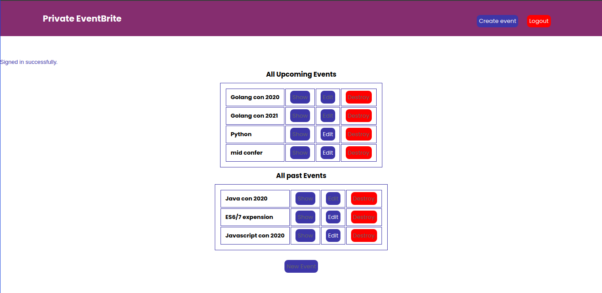

# Private eventbrite

## Project description
This project is for learning purpose just to get familiar with Associations in Ruby on Rails and active records. It is gotten from [The Odin Project](https://www.theodinproject.com/lessons/associations).

A site similar to a private Eventbrite was built which allows users to create events and then manage user signups, where users can create events, attend many events and an event can be attended by many users.

## Screenshot

## Tools and technologies used to build this project
1. [Ruby 2.7.1](https://www.ruby-lang.org/en/news/2020/03/31/ruby-2-7-1-released/)
1. [Ruby on Rails 6.0.3.2](https://weblog.rubyonrails.org/2020/6/17/Rails-6-0-3-2-has-been-released/)

## Running and testing it locally

### Prerequisites
1. You should have [Ruby 2.7.1](https://www.ruby-lang.org/en/news/2020/03/31/ruby-2-7-1-released/)
1. You need to have [Rails 6.0.3.2](https://weblog.rubyonrails.org/2020/6/17/Rails-6-0-3-2-has-been-released/)

### Setup && usage
1. Clone this repository with `git clone https://github.com/descholar-ceo/private-events.git`
1. Go inside this repo locally by typing `cd private-events`
1. Run `bundle install` to install all ruby gems
1. Run `yarn` to install Javascript dependencies
1. Run `bin/rails db:migrate` to create necessary tables in the database
1. Run `rails server`
1. Signup and create some events
1. To create an invitation click the `invite someone` in the navigation bar
1. To see a list of all events, click on home button on the navbar
1. To see event's show page, navigate to the `all events` page and click on any event's `show` button

## Contributing
There are two ways of contributing to this project:

1. If you see something wrong or not working, please open the issue in issue section
2. If you see something to improve or to correct, and you have a solution to that, follow the below steps to contribute:
    1. Fork this repository
    2. Clone it on your local computer by running `git clone https://github.com/your-username/private-events.git` __Replace *your username* with the username you use on github__
    3. Open the cloned repository which appears as a folder on your local computer with your favorite code editor
    4. Create a separate branch off the *master branch*,
    5. Write your codes which fix the issue you found
    6. Commit and push the branch you created
    7. Open a pull request, comparing your new created branch with our original master branch [here](https://github.com/descholar-ceo/private-events)

## Authors
### 1. MUGIRASE Emmanuel
* Github: [@descholar-ceo](https://github.com/descholar-ceo)
* Twitter: [@descholar3](https://twitter.com/descholar3)
* LinkedIn: [MUGIRASE Emmanuel](https://www.linkedin.com/in/mugirase-emmanuel)

### 2. Witah Ngu Georjane
* Github: [@Georjane](https://github.com/Georjane)
* Twitter: [@WittyJany](https://twitter.com/WittyJany)
* LinkedIn: [Witah Georjane](https://www.linkedin.com/in/witah-georjane)

## Show your support 
Give a ⭐️ if you like this project!

## Acknowledgment
* [Microverse](https://www.microvese.org)
* [The Odin Project](https://www.theodinproject.com)
